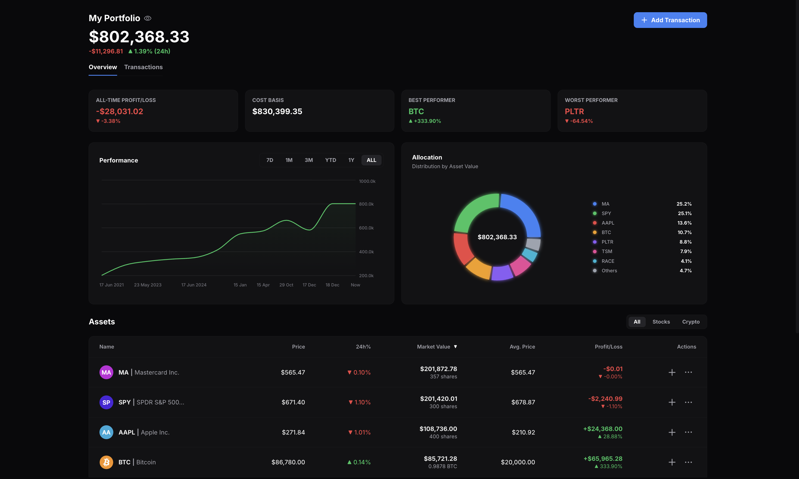

# 📈 Portfolio Tracker

A modern investment portfolio tracker built with React. Track stocks and cryptocurrencies in one place with real-time price updates, visual analytics, and comprehensive transaction management. The app calculates profit/loss using industry-standard FIFO (First In, First Out) cost basis methodology.



## ✨ Features

- **Price Tracking** - Stock and crypto prices with 24h change indicators (auto-refreshes every 5 minutes)
- **FIFO Cost Basis** - Accurate profit/loss calculation using First-In-First-Out methodology
- **Transaction Management** - Add, edit, and delete buy/sell transactions with validation
- **Portfolio Analytics** - Performance charts and allocation pie charts with time filters
- **Privacy Mode** - One-click toggle to hide sensitive portfolio values
- **Auth** - Email/password via Supabase Auth (JWT). Profiles support `user` and `admin` roles; Row Level Security enforces data access on the server

## 🛠️ Tech Stack

| Category             | Technologies                            |
| -------------------- | --------------------------------------- |
| **Frontend**         | React 19, React Router DOM              |
| **State Management** | TanStack Query (React Query)            |
| **Styling**          | Tailwind CSS                            |
| **Charts**           | Recharts                                |
| **Build Tool**       | Vite                                    |
| **Backend**          | Supabase (Postgres + Auth + RLS)        |
| **APIs**             | TwelveData (stocks), CoinGecko (crypto) |
| **Icons**            | Phosphor Icons                          |
| **Hosting**          | Vercel (SPA rewrites included)          |

## 📁 Project Structure

```
src/
├── context/
│   └── AuthContext.jsx         # Session, profile role, sign in/out
├── lib/
│   └── supabaseClient.js       # Singleton browser client (anon key only)
├── components/
│   ├── Login.jsx               # Email auth; warns if env missing
│   ├── ProtectedRoute.jsx      # Requires Supabase config + session
│   └── ...
├── hooks/
│   └── usePortfolio.js         # Queries/mutations → supabaseDb
├── services/
│   ├── supabaseDb.js           # Transaction CRUD
│   └── api.js                  # Market data (optional API keys)
supabase/migrations/
└── 001_initial_schema.sql      # Run in Supabase SQL editor
```

## 🚀 Getting Started

### Prerequisites

- Node.js 18+
- A [Supabase](https://supabase.com) project
- (Optional) TwelveData / CoinGecko keys for live prices

### Installation

```bash
npm install
cp .env.example .env
# fill VITE_SUPABASE_* and optional market keys

npm run dev
```

Open [http://localhost:5173](http://localhost:5173). You will be redirected to `/login` until you sign in.

### Supabase setup

1. Create a project and run `supabase/migrations/001_initial_schema.sql` in the **SQL Editor** (creates `profiles`, `transactions`, RLS, and the new-user trigger).
2. In **Authentication → Providers**, enable Email.
3. Copy **Project URL** and **anon public** key into `.env` as `VITE_SUPABASE_URL` and `VITE_SUPABASE_ANON_KEY`.
4. **Admin users**: new signups get `role = user`. Promote an account in SQL:

   ```sql
   update public.profiles set role = 'admin' where id = '<user-uuid>';
   ```

   Admins can read and manage all rows in `transactions` (per RLS). Regular users only see their own.

## 🔐 Environment variables

See `.env.example`. Important:

| Variable | Where to use | Notes |
| -------- | ------------ | ----- |
| `VITE_SUPABASE_URL` | Vercel + local | Public |
| `VITE_SUPABASE_ANON_KEY` | Vercel + local | Public; safe in browser with RLS |
| `SUPABASE_SERVICE_ROLE_KEY` | **Never** in this repo | Bypasses RLS; server-only secrets |

**JWT and localStorage:** Supabase stores the session JWT in `localStorage` by default. That is normal for SPAs. Do not ship the **service role** key in Vite—anything prefixed with `VITE_` is embedded in the client bundle.

Optional market data keys (`VITE_TWELVE_DATA_API_KEY`, `VITE_COINGECKO_API_KEY`) are also exposed to the browser; prefer URL-restricted or low-privilege keys where the provider allows it.

## ▲ Deploying to Vercel

1. Connect the Git repository and set **Framework Preset** to Vite (or let Vercel auto-detect).
2. Add environment variables: `VITE_SUPABASE_URL`, `VITE_SUPABASE_ANON_KEY`, and any optional `VITE_*` market keys.
3. `vercel.json` includes SPA fallbacks so client-side routes (e.g. `/asset/AAPL`) resolve correctly.

## 🗄️ Database schema (summary)

**`profiles`** — `id` (FK `auth.users`), `email`, `role` (`user` | `admin`).

**`transactions`** — `user_id`, `ticker`, `name`, `type`, `quantity`, `price`, `total_cost`, `asset_class`, `occurred_at`, timestamps.

Field names in the app UI (e.g. “Order Type”, “Asset Class”) still map to these columns inside `supabaseDb.js`.

## 🎯 What I Learned

- **TanStack Query** - Declarative data fetching with built-in caching, background refetching, and optimistic updates significantly reduced boilerplate while improving UX
- **Component Abstraction** - Extracting reusable UI components (`FormInput`, `ButtonGroup`, `IconButton`) and custom hooks (`useSort`, `useClickOutside`) reduced code duplication by ~60%
- **Resilient API Design** - Multi-layer caching (fresh → stale → expired), batch API requests to minimize rate limit usage, and graceful degradation ensure the app works even when APIs fail
- **Financial Domain Logic** - Implementing FIFO cost basis required understanding investment accounting—processing transactions chronologically while maintaining buy queues per asset
- **Single Source of Truth** - Consolidating shared data (like crypto mappings) into centralized constants prevents drift and simplifies maintenance

## 🔮 Future Enhancements

- Historical price charts for individual assets
- Multiple portfolio support (retirement, trading accounts)
- CSV import/export for bulk transactions
- Dividend and income tracking
- Price alerts and notifications
- PWA support for offline access
