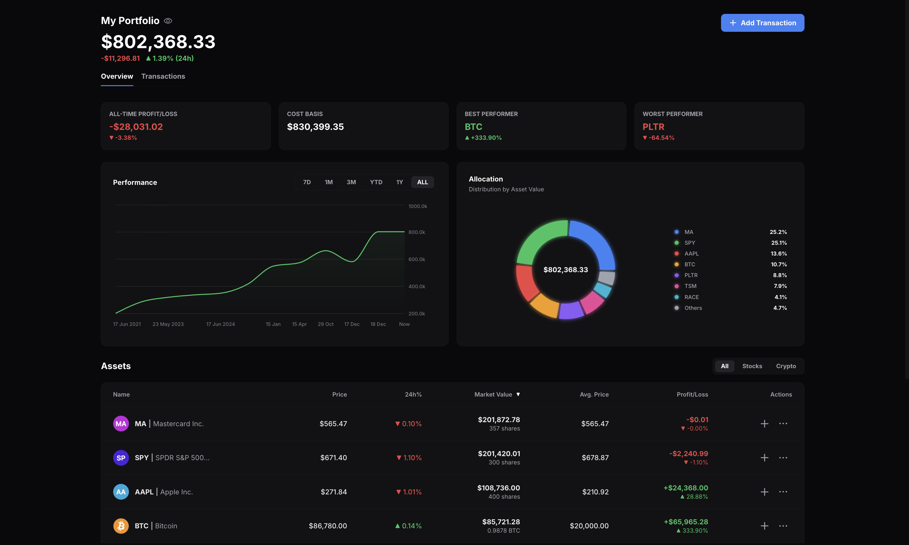

# 📈 Portfolio Tracker

A modern investment portfolio tracker built with React. Track stocks and cryptocurrencies in one place with real-time price updates, visual analytics, and comprehensive transaction management. The app calculates profit/loss using industry-standard FIFO (First In, First Out) cost basis methodology.



## ✨ Features

- **Price Tracking** - Stock and crypto prices with 24h change indicators (auto-refreshes every 5 minutes)
- **FIFO Cost Basis** - Accurate profit/loss calculation using First-In-First-Out methodology
- **Transaction Management** - Add, edit, and delete buy/sell transactions with validation
- **Portfolio Analytics** - Performance charts and allocation pie charts with time filters
- **Privacy Mode** - One-click toggle to hide sensitive portfolio values

## 🛠️ Tech Stack

| Category             | Technologies                            |
| -------------------- | --------------------------------------- |
| **Frontend**         | React 19, React Router DOM              |
| **State Management** | TanStack Query (React Query)            |
| **Styling**          | Tailwind CSS                            |
| **Charts**           | Recharts                                |
| **Build Tool**       | Vite                                    |
| **Database**         | Airtable                                |
| **APIs**             | TwelveData (stocks), CoinGecko (crypto) |
| **Icons**            | Phosphor Icons                          |

## 🎯 What I Learned

- **TanStack Query** - Declarative data fetching with built-in caching, background refetching, and optimistic updates significantly reduced boilerplate while improving UX
- **Component Abstraction** - Extracting reusable UI components (`FormInput`, `ButtonGroup`, `IconButton`) and custom hooks (`useSort`, `useClickOutside`) reduced code duplication by ~60%
- **Resilient API Design** - Multi-layer caching (fresh → stale → expired), batch API requests to minimize rate limit usage, and graceful degradation ensure the app works even when APIs fail
- **Financial Domain Logic** - Implementing FIFO cost basis required understanding investment accounting—processing transactions chronologically while maintaining buy queues per asset
- **Single Source of Truth** - Consolidating shared data (like crypto mappings) into centralized constants prevents drift and simplifies maintenance

## 🔮 Future Enhancements

- Historical price charts for individual assets
- Multiple portfolio support (retirement, trading accounts)
- CSV import/export for bulk transactions
- Dividend and income tracking
- Price alerts and notifications
- Dark/light theme toggle
- PWA support for offline access

## 📁 Project Structure

```
src/
├── components/
│   ├── Dashboard.jsx           # Main portfolio view with charts & tables
│   ├── AssetDetails.jsx        # Individual asset page with history
│   ├── PortfolioTable.jsx      # Sortable assets table with actions
│   ├── PortfolioCharts.jsx     # Performance & allocation charts
│   ├── TransactionFormModal.jsx # Add/edit transaction form
│   ├── Layout.jsx              # Page wrapper with footer
│   └── ui/                     # Reusable UI components
│       ├── FormInput.jsx       # Form input with validation
│       ├── ButtonGroup.jsx     # Button group with variants (pills, tabs, toggle)
│       ├── AssetDropdown.jsx   # Asset autocomplete dropdown
│       ├── StatCard.jsx        # Metric display card
│       ├── AssetLogo.jsx       # Logo with fallback
│       ├── Button.jsx          # Button component with primary variant
│       ├── IconButton.jsx      # Icon button with variants (edit, delete, add, more, close)
│       ├── TransactionTypeBadge.jsx # Buy/Sell badge
│       ├── LoadingState.jsx    # Loading indicator
│       └── EmptyState.jsx      # Empty table state
├── hooks/
│   ├── usePortfolio.js         # TanStack Query hooks for data
│   ├── useTransactionModal.js  # Modal state management
│   ├── useSort.js              # Reusable table sorting
│   └── useClickOutside.js      # Click outside detection
├── services/
│   ├── airtable.js             # Database CRUD operations
│   ├── api.js                  # Price fetching with caching
│   ├── cache.js                # Centralized cache utilities
│   └── utils.js                # Formatting & calculations
├── constants/
│   └── assets.js               # Centralized asset data & crypto mappings
└── App.jsx                     # Router setup
```

## 🚀 Getting Started

### Prerequisites

- Node.js 18+
- Airtable account (free tier works)
- TwelveData API key (free tier available)
- CoinGecko API key (optional)

### Installation

```bash
# Clone the repository
git clone <repository-url>
cd Portfolio-Tracker-App

# Install dependencies
npm install

# Set up environment variables (see below)

# Start development server
npm run dev
```

Open [http://localhost:5173](http://localhost:5173) in your browser.

## 🔐 Environment Variables

Create a `.env` file in the root directory:

```env
# Airtable Configuration
VITE_AIRTABLE_API_KEY=your_airtable_api_key
VITE_AIRTABLE_BASE_ID=your_airtable_base_id
VITE_AIRTABLE_TABLE_ID=your_airtable_table_id  # Optional

# TwelveData API (for stock prices)
VITE_TWELVE_DATA_API_KEY=your_twelvedata_api_key

# CoinGecko API (optional, works without key but with rate limits)
VITE_COINGECKO_API_KEY=your_coingecko_api_key

# BullionStar API (for Commodity asset type - precious metals prices)
VITE_BULLIONSTAR_API_KEY=your_bullionstar_api_key
```

The BullionStar key is used when adding **Commodity** assets (e.g. Gold, Silver). For API base URL, endpoint paths, and rate limits, see the [BullionStar developer documentation](https://www.bullionstar.com/developer/docs).

## 🗄️ Airtable Schema

Create a table in Airtable with the following columns:

| Column Name | Field Type     | Description                        |
| ----------- | -------------- | ---------------------------------- |
| Ticker      | Single line    | Asset symbol (e.g., AAPL, BTC)     |
| Name        | Single line    | Asset name (e.g., Apple Inc.)      |
| Asset Class | Single select  | `Stock` or `Crypto`                |
| Order Type  | Single select  | Transaction type: `Buy` or `Sell`  |
| Price       | Number         | Price per unit at transaction time |
| Quantity    | Number         | Number of shares/coins             |
| Total Cost  | Formula/Number | Quantity × Price                   |
| Date        | Date           | Transaction date and time          |
